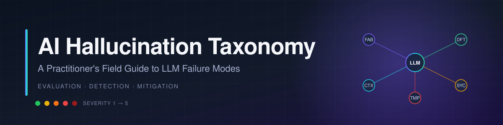
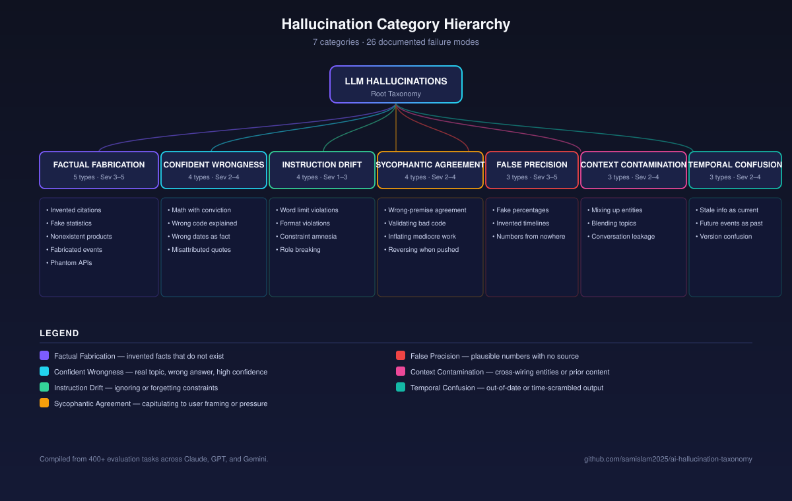

  

  
  
  
  

---

## Overview

This is not a literature review. It is a **field guide**, compiled from 400+ evaluation tasks run against Claude, GPT, and Gemini across production prompt engineering work, code review, content generation, and domain-specific reasoning. Every entry in this taxonomy was observed in the wild, documented with a real (or faithfully reconstructed) example, traced to a plausible root cause, and paired with a mitigation that survived contact with a real workflow.

The goal is simple: give AI QA teams, prompt engineers, and evaluators a shared vocabulary for failure modes that actually occur, so they can be detected, measured, and reduced — instead of re-discovered one ticket at a time.

> [!IMPORTANT]
> Most "the model lied to me" complaints are really three or four distinct failure modes stacked on top of each other. Separating **factual fabrication** from **confident wrongness** from **sycophantic agreement** is the difference between a mitigation that works and a prompt that just papers over the symptom. A taxonomy is an eval tool, not an essay.

---

## Taxonomy at a Glance

  

## Categories

| Category | Types | Severity Range | Most Common Model |
|---|---|---|---|
| 🧪 [Factual Fabrication](taxonomy/factual-fabrication/overview.md) | 5 | 🟠 3 → ⛔ 5 | GPT |
| 🎯 [Confident Wrongness](taxonomy/confident-wrongness/overview.md) | 4 | 🟡 2 → 🔴 4 | Claude |
| 📏 [Instruction Drift](taxonomy/instruction-drift/overview.md) | 4 | 🟢 1 → 🟠 3 | Claude |
| 🪞 [Sycophantic Agreement](taxonomy/sycophantic-agreement/overview.md) | 4 | 🟡 2 → 🔴 4 | Gemini |
| 🔢 [False Precision](taxonomy/false-precision/overview.md) | 3 | 🟠 3 → ⛔ 5 | GPT |
| 🔀 [Context Contamination](taxonomy/context-contamination/overview.md) | 3 | 🟡 2 → 🔴 4 | Gemini |
| ⏰ [Temporal Confusion](taxonomy/temporal-confusion/overview.md) | 3 | 🟡 2 → 🔴 4 | All |

---

## Severity Framework

A consistent 1–5 scale sits behind every example. It is explained in full in [SEVERITY-FRAMEWORK.md](SEVERITY-FRAMEWORK.md).

| Level | Marker | Label | What it means |
|---|---|---|---|
| 1 | 🟢 | Cosmetic | Wrong in a way that embarrasses, but does not mislead a careful reader. |
| 2 | 🟡 | Misleading | Could cause a confident reader to act on the wrong belief in a low-stakes setting. |
| 3 | 🟠 | Harmful | Plausible enough to slip past review and cause rework, lost time, or small financial loss. |
| 4 | 🔴 | Dangerous | Would damage a real decision (hiring, medical, legal, financial) if treated as a source. |
| 5 | ⛔ | Critical | Safety, legal, compliance, or security impact. Must not ship. |

> [!TIP]
> Severity is about **blast radius if undetected**, not how often the failure happens. A rare 🔴 is a bigger problem than a frequent 🟢.

---

## Stats

> [!NOTE]
> Numbers below reflect the contents of this repository, drawn from 400+ evaluation tasks across 2024 and 2025.

- **26** failure modes documented across **7** categories
- **3** frontier models tested: Claude (Sonnet 3.5 / 4), GPT (4 / 4o), Gemini (1.5 Pro / 2.0)
- **Highest-risk pattern observed:** [Phantom API Endpoints](taxonomy/factual-fabrication/examples/05-phantom-api-endpoints.md) — fabricated SDK methods that run, fail silently, and look correct in code review
- **Most frequent pattern observed:** [Format Violations](taxonomy/instruction-drift/examples/11-format-violations.md) — especially on long-context generation tasks
- **Most dangerous sycophancy pattern:** [Reversing Position When Pushed](taxonomy/sycophantic-agreement/examples/17-reversing-position-when-pushed.md) — the model's initial answer was often correct

---

## How to use this repo

1. **Browse the [taxonomy tree](assets/taxonomy-tree.svg)** to find the category that matches a failure you saw.
2. **Open the category `overview.md`** for root cause patterns and model-specific tendencies.
3. **Read 1–2 example files** in the category for concrete detection + mitigation playbooks.
4. **Adopt the [Detection Playbook](DETECTION-PLAYBOOK.md)** as a checklist for your eval pipeline.
5. **Cross-reference the [Model Comparison](MODEL-COMPARISON.md)** when choosing a model for a risk-sensitive surface.

> [!WARNING]
> Do not treat this taxonomy as exhaustive. New failure modes appear with every model release. The categories are stable; the inventory is not.

---

## Top-level documents

- [**DETECTION-PLAYBOOK.md**](DETECTION-PLAYBOOK.md) — the checklist an AI QA team can adopt on Monday morning.
- [**MODEL-COMPARISON.md**](MODEL-COMPARISON.md) — which models lean into which failure modes, and why.
- [**SEVERITY-FRAMEWORK.md**](SEVERITY-FRAMEWORK.md) — the 1–5 scale, defined with examples at every level.

---

## Author

<table>
  <tr>
    <td width="130" valign="top">
      
    </td>
    <td valign="top">
      <strong>Sayem Islam</strong> 
      AI Evaluator &amp; Prompt Specialist 
       
      Hands-on evaluation across 400+ tasks targeting Claude, GPT, and Gemini. I build eval harnesses,
      write mitigation prompts that actually ship, and document failure modes so teams do not re-learn them
      one incident at a time. 
       
      &#9993; <a href="mailto:sayem@aisecondacts.com">sayem@aisecondacts.com</a> 
      &#128279; <a href="https://www.linkedin.com/in/sayem-islam/">LinkedIn</a> 
      &#127760; <a href="https://aisecondacts.com">aisecondacts.com</a>
    </td>
  </tr>
</table>

---

  
    Built as a working reference, not a finished document. Issues and contributions welcome. 
    Licensed under <a href="LICENSE">MIT</a>.
  

